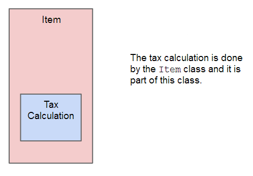
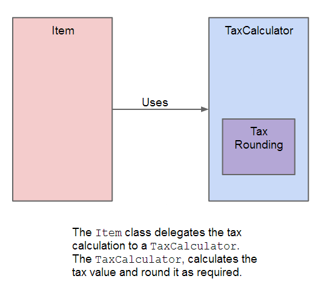
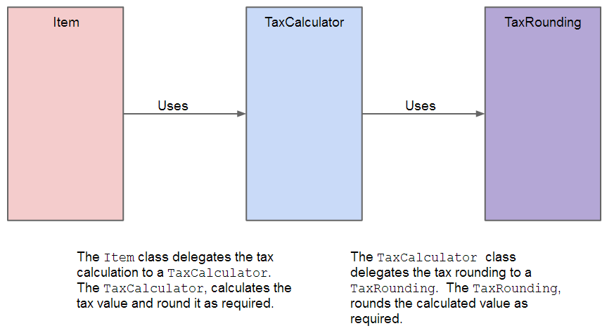
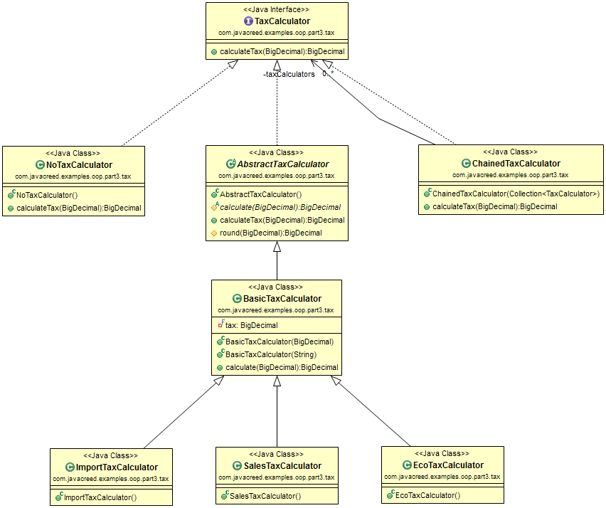

Object Oriented Programming changed the way we build programs.  It enabled us to create rich objects encapsulating both scope (_fields_) and logic (_methods_).  While most of the modern programming languages, such as Java ([Homepage](http://www.oracle.com/technetwork/java/javase/downloads/index.html)), support objects (and object oriented programming), many implementations make pure use of them.  In this article we will see how objects can be used to our advantage and how to think in an _object oriented way_.

Most of the examples will not contain the whole code and may omit fragments which are not relevant to the example being discussed.  The readers can download or view all code from the above link.

This article first introduces a problem and then develops several solutions to address this problem.  Each solution is discussed in some detail and a special emphasis is placed on its weaknesses.  The next solution improves on the weaknesses of the previous one until we reach a good version that addresses our problem and makes good use of object oriented programming.

## The Problem

Most of the goods sold at a store have sales tax at a rate of 18% with the exception to books, food and medical products.  Products belonging to any of these categories are exempted from sales tax.  Any products that are imported have an import tax of 3% and all electronics (imported or not) have another ECO contribution tax of 5%.  Note that an item can carry one or more taxes as we will see in the following examples.  In this case the tax is always calculated on the original value.  Finally, all tax values should be rounded up to the nearest 0.05 value.  <strong>Please note that the above taxation figures are <u>fictitious</u> and are only used for demonstration purpose</strong>.

Following are some examples:

|Description         |Price Before Tax|Sales Tax (18%)|Import Tax (3%)|Echo Tax (5%)|Total Tax|
|--------------------|---------------:|--------------:|--------------:|------------:|--------:|
|Book                |           48.50|           0.00|           0.00|         0.00|     0.00|
|Imported Calculator |           12.25|   2.25 (2.205)|  0.40 (0.3675)|0.65 (0.6125)|     3.30|
|Imported Medicine   |            8.40|           0.00|   0.30 (0.252)|         0.00|     0.30|

The imported calculator has a sales tax of 2.205, which we obtained by multiplying the value before tax 125.25 with the sales tax of 18%:  _12.25 &times; 0.18 = 2.205_.  We have to round this to the nearest 0.05 up which yields: 2.25.  The same applies to all other taxes and products.

We need to create a simple receipt printing system where it prints a list of items that are purchased and the tax paid.  The program should produce a detailed receipt which lists the name of all items and their selling price including the total tax.  At the end of the receipt we have a summary showing the total number of items, the total tax amount and the total price including the tax.

Following is an example of a receipt:

```
Items
 Book                     48.50
 Imported Calculator      15.55
 Imported Medicine         8.70

Summary
 Items                        3
 Tax                       3.60
--------------------------------
 Total                    72.75
--------------------------------
```

We need to come up with a solution that address these requirements while keeping our program flexible for future modifications.  As the title of this article hints, we need to make good use of objects and object oriented programming.  We need to address two things: first we need to understand this problem and then we need to understand how this problem may change and evolve in the future.  The latter is quite important as it will help us achieve a more flexible design ready for future needs.  This is not something easy to achieve and it may require a substantial amount of domain knowledge in order to be able to do this right.  Someone that has little knowledge about taxation, for example, cannot predict or anticipate future changes in this area.

In the coming sections we will describe and analyse several solutions starting from a naive implementation and improving it with every iteration.  One can be tempted to jump to the final solution but doing so will skip the thought behind certain decisions.  It is highly recommended to read through all solutions and try to identify the pitfalls of each design before reading the related solution.

## First Solution

An item within a shopping basket needs to have the following

1. The name, such as: "_Book_".  This will appear in the receipt shown before.
1. The price before tax is applied.  This value is used to calculate the tax for this item.
1. The tax (or taxes) applicable to this item.

Consider the following class.

```java
package com.javacreed.examples.oop.part1;

import java.math.BigDecimal;
import java.math.RoundingMode;

public class Item {

  private final String name;
  private final BigDecimal price;
  private final BigDecimal tax;

  public Item(final String name, final BigDecimal price, final BigDecimal tax) {
    this.name = name;
    this.price = price;
    this.tax = tax;
  }

  public Item(final String name, final String price, final String tax) throws NumberFormatException {
    this(name, new BigDecimal(price), new BigDecimal(tax));
  }

  public BigDecimal calculateTax() {
    BigDecimal taxValue= tax.multiply(price);
    taxValue= taxValue.multiply(new BigDecimal("20")).setScale(0, RoundingMode.UP).setScale(2);
    taxValue= taxValue.divide(new BigDecimal("20"), RoundingMode.UP);

    return taxValue;
  }

  public BigDecimal getSellingPrice() {
    return price.add(calculateTax());
  }

  /* Some methods were omitted for brevity */
}
```

The `Item` class has three fields.  The third field represents the total tax applicable to this item.  For example, a book has 0% tax while the imported calculator has a total of 26% tax (_Sales tax 18% + Import tax 3% + ECO tax 5% = 26%_).  This class has two constructors one of which is more of a convenience constructor.  In order to create an instance of the `Item` class we need to create to `BigDecimal` ([Java Doc](http://docs.oracle.com/javase/7/docs/api/java/math/BigDecimal.html)).   The second constructor takes three `String`s and then creates two `BigDecimal`s from the last two.  This allows to create an instance of the `Item` class as shown below.

```java
new Item("Book", "48.50", "0")
```

This is simpler than the following alternative method as we do not need to create two instances of the `BigDecimal` class.

```java
new Item("Book", new BigDecimal("48.50"), new BigDecimal("0"))
```

When designing objects, try to make the life of other developers, who will be using your code, simpler by providing simpler methods/constructors interfaces (or signature).  In this case, the second constructor simplifies the creation of the `Item` class.  The sooner you provide such methods the more time you will save.  You do not have to go too far and you can create such methods (or constructors) when required.

The method names are quite intuitive.  This is another important point.  The method names alone tells you what they do.  The method `calculateTax()` will calculate the tax for this item, while the other method `getSellingPrice()` returns the item price including the tax.  The receipt shows a list of items followed by their price which includes tax.  This value is obtained from the `getSellingPrice()` method.

Method names should always indicate what a method does as we saw above.  But sometimes this is not enough and one needs to put extra care.  For example in some countries, the selling price does not include tax, while in other countries the price indicated is the final price, that is, including tax.  In Canada, for instance, the price indicated on the product shelves does not include the tax while in Malta, it is mandatory by law to show the final price of the product (include all applicable taxes).  In this case documentation is necessary to mitigate any doubts and the risk of misuse.

Before we start criticizing this solution we need to create some other classes which can be used to ascertain the correctness of a receipt.  Following is the `Basket` class which will contain all items and performs certain calculations, such as the total tax to be printed on the receipt.

```java
package com.javacreed.examples.oop.part1;

import java.math.BigDecimal;
import java.text.DecimalFormat;
import java.text.NumberFormat;
import java.util.ArrayList;
import java.util.List;

public class Basket {

  private final List<Item> items = new ArrayList<>();

  public BigDecimal getTotalPrice() {
    BigDecimal total = BigDecimal.ZERO;
    for (final Item item : items) {
      total = total.add(item.getSellingPrice());
    }

    return total;
  }

  public BigDecimal getTotalTax() {
    BigDecimal total = BigDecimal.ZERO;
    for (final Item item : items) {
      total = total.add(item.calculateTax());
    }
  }

  public int size() {
    return items.size();
  }

    return total;
  }

  /* Some methods were removed for brevity */
}
```

This class is responsible from a list of items, similar to a shopping cart or basket.  It provides several methods to help managing items within a basket, three of which are described shortly.  The `getTotalPrice()` returns the total selling price, including any applicable taxes, for all products in the basket.  The `getTotalTax()` return the total amount of tax to be paid while the `size()` method returns the number of items in the basket.  These three method provide the information shown in the summary section of the receipt.

We will test our first version using JUnit ([Homepage](http://junit.org/)) as shown below.

```java
package com.javacreed.examples.oop.part1;

import java.math.BigDecimal;

import org.junit.Assert;
import org.junit.Test;

public class TaxTest {

  @Test
  public void test() {
    final Basket basket = new Basket();
    basket.add(new Item("Book", "48.50", "0"));
    basket.add(new Item("Imported Calculator", "12.25", "0.26"));
    basket.add(new Item("Imported Medicine", "8.40", "0.03"));

    Assert.assertEquals(3, basket.size());
    Assert.assertEquals(new BigDecimal("3.60"), basket.getTotalTax());
    Assert.assertEquals(new BigDecimal("72.75"), basket.getTotalPrice());
  }
}
```

This seems to be a feasible solution but has some limitations and is incorrect.  This solution has several limitations and a bug.  We will start by fixing the bug first as this can be easily identified using our test class `TaxTest`.  In fact if you run the test class it will fail as shown below.

```
java.lang.AssertionError: expected:<3.60> but was:<3.50>
	at org.junit.Assert.fail(Assert.java:88)
	at org.junit.Assert.failNotEquals(Assert.java:743)
	at org.junit.Assert.assertEquals(Assert.java:118)
	at org.junit.Assert.assertEquals(Assert.java:144)
	at com.javacreed.examples.oop.part1.TaxTest.test(TaxTest.java:18)
	at sun.reflect.NativeMethodAccessorImpl.invoke0(Native Method)
	at sun.reflect.NativeMethodAccessorImpl.invoke(NativeMethodAccessorImpl.java:57)
	at sun.reflect.DelegatingMethodAccessorImpl.invoke(DelegatingMethodAccessorImpl.java:43)
	at java.lang.reflect.Method.invoke(Method.java:601)
	at org.junit.runners.model.FrameworkMethod$1.runReflectiveCall(FrameworkMethod.java:47)
	at org.junit.internal.runners.model.ReflectiveCallable.run(ReflectiveCallable.java:12)
	at org.junit.runners.model.FrameworkMethod.invokeExplosively(FrameworkMethod.java:44)
	at org.junit.internal.runners.statements.InvokeMethod.evaluate(InvokeMethod.java:17)
	at org.junit.runners.ParentRunner.runLeaf(ParentRunner.java:271)
	at org.junit.runners.BlockJUnit4ClassRunner.runChild(BlockJUnit4ClassRunner.java:70)
	at org.junit.runners.BlockJUnit4ClassRunner.runChild(BlockJUnit4ClassRunner.java:50)
	at org.junit.runners.ParentRunner$3.run(ParentRunner.java:238)
	at org.junit.runners.ParentRunner$1.schedule(ParentRunner.java:63)
	at org.junit.runners.ParentRunner.runChildren(ParentRunner.java:236)
	at org.junit.runners.ParentRunner.access$000(ParentRunner.java:53)
	at org.junit.runners.ParentRunner$2.evaluate(ParentRunner.java:229)
	at org.junit.runners.ParentRunner.run(ParentRunner.java:309)
	at org.eclipse.jdt.internal.junit4.runner.JUnit4TestReference.run(JUnit4TestReference.java:50)
	at org.eclipse.jdt.internal.junit.runner.TestExecution.run(TestExecution.java:38)
	at org.eclipse.jdt.internal.junit.runner.RemoteTestRunner.runTests(RemoteTestRunner.java:467)
	at org.eclipse.jdt.internal.junit.runner.RemoteTestRunner.runTests(RemoteTestRunner.java:683)
	at org.eclipse.jdt.internal.junit.runner.RemoteTestRunner.run(RemoteTestRunner.java:390)
	at org.eclipse.jdt.internal.junit.runner.RemoteTestRunner.main(RemoteTestRunner.java:197)
```

The method `getTotalTax()` within the `Basket` class returned _3.50_ instead of _3.60_ as indicated by the test results.  While this bug makes customers happy, it may put the software house responsible from this program in serious trouble.  The bug lies in the rounding method.  Our solution does not meet the requirement quoted below.

> Finally, all tax values should be rounded up to the nearest 0.05

Many projects do without or with minimum testing.  As we saw here, even the simplest programs can have flaws and test cases, such as the one we have, will help you identify these problems and verify that the solution applied works well.  With that said, we do not have to take this to the other extreme and test everything including the simple _getters_ and _setters_.  Be pragmatic and test the code that has a critical impact on the project, such as the tax calculation.  Furthermore, a test can cover several parts of the code.  In our example we are verifying (or ascertaining) three things: the number of items (which indirectly verifies that the `add()` method works well despite the fact that it is not tested directly), the tax calculation and the total calculation.

We know that this solution has a bug and other limitations which we still have to discuss.  Before we analyse these limitations, we will try to find a solution to the bug first.

When analysing problems never try to solve everything at once.  Instead try to solve one problem at a time as you need to make sure that your changes are producing the correct effects.

## Fixing the Bug

The solution to our bug is quite simple.  The issue was created when we aggregated the tax into one tax value of 26%.  This is not equivalent to: _round(value &times; 18%) + round(value &times; 3%) + round(value &times; 5%)_ due to the custom rounding that needs to take place after every tax calculation.

Instead of aggregating all taxes into one single value, we save an array of taxes values as shown in the new version of the `Item`.

```java
package com.javacreed.examples.oop.part2;

import java.math.BigDecimal;
import java.math.RoundingMode;

public class Item {

  private static BigDecimal[] parseAll(final String... strings) throws NumberFormatException {
    final BigDecimal[] numbers = new BigDecimal[strings.length];
    for (int i = 0; i < strings.length; i++) {
      numbers[i] = new BigDecimal(strings[i]);
    }
    return numbers;
  }

  private final String name;
  private final BigDecimal price;
  private final BigDecimal[] taxes;

  public Item(final String name, final BigDecimal price, final BigDecimal... taxes) {
    this.name = name;
    this.price = price;
    this.taxes = taxes;
  }

  public Item(final String name, final String price, final String... taxes) throws NumberFormatException {
    this(name, new BigDecimal(price), Item.parseAll(taxes));
  }

  public BigDecimal calculateTax() {
    BigDecimal totalTax = BigDecimal.ZERO;
    for (final BigDecimal tax : this.taxes) {
      BigDecimal taxValue = tax.multiply(price);
      taxValue = taxValue.multiply(new BigDecimal("20")).setScale(0, RoundingMode.UP).setScale(2);
      taxValue = taxValue.divide(new BigDecimal("20"), RoundingMode.UP);

      totalTax = totalTax.add(tax);
    }

    return totalTax;
  }

  public BigDecimal getSellingPrice() {
    return price.add(calculateTax());
  }
}
```

Most of the changes applied are straightforward.  Since we will be saving the taxes into an array, we had to change all places where this field was used, including the constructor.  A utility static method, `parseAll()`, was added that takes an array of `String`s and returns an array of `BigDecimal`s.  This is used by the second constructor to parse the varargs ([Documentation](http://docs.oracle.com/javase/1.5.0/docs/guide/language/varargs.html)) of `String`s to an array of `BigDecimal`.

This change fixed our bug as confirmed by the following test class.

```java
package com.javacreed.examples.oop.part2;

import java.math.BigDecimal;

import org.junit.Assert;
import org.junit.Test;

public class TaxTest {

  @Test
  public void test() {
    final Basket basket = new Basket();
    basket.add(new Item("Book", "48.50", "0"));
    basket.add(new Item("Imported Calculator", "12.25", "0.18", "0.03", "0.05"));
    basket.add(new Item("Imported Medicine", "8.40", "0.03"));

    Assert.assertEquals(3, basket.size());
    Assert.assertEquals(new BigDecimal("3.60"), basket.getTotalTax());
    Assert.assertEquals(new BigDecimal("72.75"), basket.getTotalPrice());
  }
}
```

Note that instead of a single value, we are passing the taxes values separately, which solves the bug.

So far we managed to produce a good working version of our program.  It addresses all our needs and is ready to be used.  But as hinted by the length of the article, this is not the final solution.  So what's wrong with this version, one may ask.  This solution does not make good use of objects and object oriented programming.  The `Item` class is responsible from computing the taxation together with representing an item within a basket.  While this works, it has some limitations.  This approach hard bounds the item with the calculation of tax for this item as shown next.



Consider the following scenarios

1. Taxation applies to other things besides items in a basket.  For example the income tax is a form of taxation where employees are taxed on their earning.  Using this approach we cannot share the tax calculation service (so to call it) with a payroll system the other team is developing.  Thus both teams will end up writing two separate solutions that do the same thing, that is calculate tax.

1. Say that the government introduces a new taxation policy where the tax value is dependent on the item value.  For example, if the item value is below 200, then a tax of 3.5% is applied.  Otherwise a tax of 5% is applied on the remaining amount.  For instance, if we purchase an item with value of 150, then the tax value of 3.5% is applied on 150.  On the other hand if we acquire an item with a value of 250, then a tax value of 3.5% is applied on the first 200, and a tax value of 5% is applied on the remaining 50.

The code within the `Item` class has low cohesion ([Wiki](http://en.wikipedia.org/wiki/Cohesion_(computer_science))).  This means that we have different concerns grouped together in one class where these can be easily split into different classes.

You should always aim for high cohesion and move out any code that does not really belong in the class.  In our example, the `Item` class should represent the item and should not be responsible from calculating tax.  This should be delegated to another class.

The current approach is very limited and cannot handle these requirements in a clean way.  The developer responsible from these changes may apply them in the same `Item` class making it more complex, more brittle (can easily break with further changes) and less flexible.  This is because we end up having all taxation logic mixed up in one class.

Our solution works as we have only one method, or strategy ([Wiki](http://en.wikipedia.org/wiki/Strategy_pattern)) to use a better term, for calculating tax.  The tax is simply calculated by multiplying the tax with the item value and round the tax value as required.  The term _strategy_ was coined by the Gang of Four ([Wiki](http://en.wikipedia.org/wiki/Design_Patterns)) and documented in their book Design Patterns Elements Reusable Object Oriented ([Book](http://www.amazon.com/Design-Patterns-Elements-Reusable-Object-Oriented-ebook/dp/B000SEIBB8)) and is the design pattern to use in this case.  Our approach will start showing cracks as soon as we introduce different taxation policies similar to that mentioned before.

This concludes our second section.  In the next and final section we will redesign our solution to make better use from objects

## Putting Objects to Good Use

Before we start our refactoring ([Wiki](http://en.wikipedia.org/wiki/Code_refactoring) and [Book](http://www.amazon.com/Refactoring-Improving-Design-Existing-Code/dp/0201485672)), we need to understand that the previous design serves our current needs well.  Thus unless required, do not change all code.  On the contrary, add comments or small notes about how the class can be improved further and apply the changes only when needed.  Remember that changes cost time and may introduce bugs.  Ideally we come up with a good and flexible design (that makes good use of object oriented principles) at the first place but this requires both experience and a bit of luck.  Thus when you realise that your design needs to be improved, simply document this and only act when required.

The following image shows our refactoring.



The tax calculation will be delegated to another class.  This class will be only responsible from calculating the tax.  Furthermore, the tax rounding will also be part of the tax calculation.  One can argue that we can externalise this too and have yet another class that takes care of that as shown next.



While this is a good move, we will not implement it in our solution.  This can happen at a later stage with minimal effort.

The new approach predicts a change in the rounding method and thus provides an easy hook up from where this can be changed as we will see at a later stage.  At the beginning we mentioned two important things, that is, understanding the problem and understanding how the problem can change in the future.  This does not mean that we have to write all code that we can think of on day one.  On the contrary, it simply mean that we should design our solution to be easily extended as we will see shortly.

Let's start refactoring the `Item` class.

```java
package com.javacreed.examples.oop.part3;

import java.math.BigDecimal;
import java.util.ArrayList;
import java.util.List;

import net.jcip.annotations.Immutable;
import net.jcip.annotations.ThreadSafe;

import com.javacreed.examples.oop.part3.tax.ChainedTaxCalculator;
import com.javacreed.examples.oop.part3.tax.EcoTaxCalculator;
import com.javacreed.examples.oop.part3.tax.ImportTaxCalculator;
import com.javacreed.examples.oop.part3.tax.SalesTaxCalculator;
import com.javacreed.examples.oop.part3.tax.TaxCalculator;

@ThreadSafe
@Immutable
public class Item {

  private final String name;
  private final BigDecimal originalPrice;
  private final TaxCalculator taxCalculator;

  public BigDecimal calculateTax() {
    return taxCalculator.calculateTax(originalPrice);
  }

  public BigDecimal getSellingPrice() {
    return originalPrice.add(calculateTax());
  }

  /* Some methods and other members were removed for brevity */
}
```

Notice that the tax calculation is delegated to the instance of `TaxCalculator` class provided at the constructor (which is not showing in the above example).  This is also known as composition, where an object contains other, somewhat complex, objects.  The `TaxCalculator` is a simple interface shown next.

```java
package com.javacreed.examples.oop.part3.tax;

import java.math.BigDecimal;

public interface TaxCalculator {

  BigDecimal calculateTax(BigDecimal value);
}
```

This interface has only one method which is used to calculate the tax for a given value.  For all that the `Item` class is concerned, the given implementation will calculate the tax based on the given value.  The `Item` requires an instance of `TaxCalculator`.  Based on our problem description, we have three types of tax and we can have a variation of them.  Following is a UML class diagram of our tax calculation solution.



Please note that the above UML class diagram was generated by the Eclipse plugin: ObjectAid UML Explorer, which can be downloaded from: `http://www.objectaid.com/update` ([Installation Instructions](http://www.objectaid.com/installation)).  While this plugin is not required, it can prove useful to generate class and sequence diagrams similar to the one shown above.

The above class diagram has too many classes.  Let's break this into small pieces and understand the reasoning behind them.

### TaxCalculator

At the top of the UML class diagram is our interface: `TaxCalculator`.  This interface defines only one method, that is the `calculateTax()`, which the `Item` class uses to calculate the tax value.  This simple interface defines our tax calculation service.  All instances of the tax calculations implement (directly or indirectly) this interface.

### NoTaxCalculator

The class `NoTaxCalculator` is a simple implementation used when no tax is used but an instance of the `TaxCalculator` is nevertheless required.  Say that we need to create an instance of an `Item` to represent a book.  We know that books, which are not imported, do not have tax.  How would we do that?

We have two options, we can either provide `null` as the `TaxCalculator` but then we need to cater for `null`s.  This approach is very common but makes poor use of objects.  Instead we can provide an instance of `NoTaxCalculator` which will always return 0 as tax value as shown next.

```java
package com.javacreed.examples.oop.part3.tax;

import java.math.BigDecimal;

public class NoTaxCalculator implements TaxCalculator {

  @Override
  public BigDecimal calculateTax(final BigDecimal value) {
    return BigDecimal.ZERO;
  }
}
```

This approach makes use of polymorphism ([Wiki](http://en.wikipedia.org/wiki/Polymorphism_(computer_science))) to calculate the correct tax value.  Polymorphism is a technique where the method that actually calculates the tax is determined at runtime, that is, when the program is running.  The `Item` class invokes the `calculateTax()` defined by the `TaxCalculator` interface, but without knowing which implementation will actually be used.  

Following is a simple example of how to use it:

```java
package com.javacreed.examples.oop.part3.examples;

import com.javacreed.examples.oop.part3.Item;
import com.javacreed.examples.oop.part3.tax.NoTaxCalculator;

public class Example1 {
  public static void main(final String[] args) {
    final Item book = new Item("Effective Java", "32.44", new NoTaxCalculator());
    System.out.println(book);
  }
}
```

The above example will produce the following:

```
Effective Java 32.44 (TAX 0.00)
```

Always prefer this approach over `null`s as the latter requires further checks which, if missed, will cause runtime errors (usually in the form of `NullPointerException` ([Java Doc](http://docs.oracle.com/javase/7/docs/api/java/lang/NullPointerException.html))).  Furthermore, this approach is easier for other developers as they do not have to worry about `null`s and checks can be added at the constructor (or other setters methods) to ascertain this.

The class `NoTaxCalculator` is stateless and thus we can have just one instance shared with everyone that requires it.  This approach is referred to as singleton ([Wiki](http://en.wikipedia.org/wiki/Singleton_pattern)), another term coined by the Gang of Four and documented in their book Design Patterns Elements Reusable Object Oriented.  This is another improvement that we can do to our class as shown next

```java
package com.javacreed.examples.oop.part3.tax;

import java.math.BigDecimal;

public class NoTaxCalculator implements TaxCalculator {

  public static final TaxCalculator INSTANCE = new NoTaxCalculator();

  private NoTaxCalculator() {}

  @Override
  public BigDecimal calculateTax(final BigDecimal value) {
    return BigDecimal.ZERO;
  }
}
```

This can be used as shown next

```java
new Item("Effective Java", "32.44", NoTaxCalculator.INSTANCE);
```

This will prevent the creation (or initialisation) of unnecessary objects, such as the `NoTaxCalculator`, where a single instance can be shared between everyone.

### ChainedTaxCalculator

The imported calculator has three different taxes.  The normal sales tax, the import tax and the ECO tax.  As we saw in the first implementation, we cannot aggregate these three into one as it will produce an incorrect value.  The `ChainedTaxCalculator` is designed to address this problem.

```java
package com.javacreed.examples.oop.part3.tax;

import java.math.BigDecimal;
import java.util.ArrayList;
import java.util.Collection;
import java.util.List;

import net.jcip.annotations.Immutable;
import net.jcip.annotations.ThreadSafe;

@ThreadSafe
@Immutable
public class ChainedTaxCalculator implements TaxCalculator {

  private final List<TaxCalculator> taxCalculators = new ArrayList<>();

  public ChainedTaxCalculator(final Collection<TaxCalculator> taxCalculators) {
    this.taxCalculators.addAll(taxCalculators);
  }

  public ChainedTaxCalculator(final TaxCalculator... taxCalculators) {
    this.taxCalculators.addAll(Arrays.asList(taxCalculators));
  }

  @Override
  public BigDecimal calculateTax(final BigDecimal value) {
    BigDecimal tax = BigDecimal.ZERO;
    for (final TaxCalculator taxCalculator : taxCalculators) {
      tax = tax.add(taxCalculator.calculateTax(value));
    }

    return tax;
  }
}
```

It iterates through all given instances of `TaxCalculator` and returns the total tax.  Following is an example of how this class can be used.

```java
package com.javacreed.examples.oop.part3.examples;

import com.javacreed.examples.oop.part3.Item;
import com.javacreed.examples.oop.part3.tax.ChainedTaxCalculator;
import com.javacreed.examples.oop.part3.tax.EcoTaxCalculator;
import com.javacreed.examples.oop.part3.tax.ImportTaxCalculator;
import com.javacreed.examples.oop.part3.tax.SalesTaxCalculator;

public class Example2 {
  public static void main(final String[] args) {
    final ChainedTaxCalculator taxCalculator = new ChainedTaxCalculator(new SalesTaxCalculator(),
        new ImportTaxCalculator(), new EcoTaxCalculator());
    final Item calculator = new Item("Imported Calculator", "12.25", taxCalculator);
    System.out.println(calculator);
  }
}
```

In the above example, we created an instance of `ChainedTaxCalculator` using three different taxations.  The above example will produce the following

```
Imported Calculator 15.55 (TAX 3.30)
```

The `ChainedTaxCalculator` can take any instance of `TaxCalculator` and can be configured as required.  Note that an instance of a `ChainedTaxCalculator` without any `TaxCalculator`s is equivalent to `NoTaxCalculator`.

Note that our implementation of `ChainedTaxCalculator` is quite naive and it allows the same `TaxCalculator` to be added several times.  Furthermore, it allows itself to be added which will lead to an infinite loop.  Additional validations are required before this class is safe to use within a production environment.

### AbstractTaxCalculator

The class `AbstractTaxCalculator` is a skeleton implementation of the `TaxCalculator` interface.

```java
package com.javacreed.examples.oop.part3.tax;

import java.math.BigDecimal;
import java.math.RoundingMode;

public abstract class AbstractTaxCalculator implements TaxCalculator {

  protected abstract BigDecimal calculate(BigDecimal value);

  @Override
  public BigDecimal calculateTax(final BigDecimal value) {
    final BigDecimal tax = calculate(value);
    final BigDecimal rounded = round(tax);
    return rounded;
  }

  protected BigDecimal round(BigDecimal value) {
    /* Rounded up to the nearest 0.05 */
    value = value.multiply(new BigDecimal("20")).setScale(0, RoundingMode.UP).setScale(2);
    value = value.divide(new BigDecimal("20"), RoundingMode.UP);
    return value;
  }
}
```

This is quite an important class, thus we will discuss it and analyse it further.  

1. The tax calculation comprise the calculation of the tax and the rounding of the tax value as shown next.

    ```java
      @Override
      public BigDecimal calculateTax(final BigDecimal value) {
        final BigDecimal tax = calculate(value);
        final BigDecimal rounded = round(tax);
        return rounded;
      }
    ```

    The method `calculateTax()` invokes two other methods: the `calculate()` and the `round()`.  The first method is     responsible from calculating the tax, while the second is responsible from rounding the tax value.  Both methods can be  overridden and replaced as required.

    Before we said that we will not externalise the tax value rounding and we did not.  We also said that we will prepare  for this and provide hook ups for possible future changes.  The  `round()` method was introduced just for this.  A subclass can easily replace this method and make use of the proper rounding mechanism.  Furthermore, the `round()` method can be parameterised to work with different rounding figures and rounding up/down methods.

1. The `calculate()` method is abstract and this must be implemented by the subclasses.  This method is expected to return the tax value ignoring any rounding.

    ```java
      protected abstract BigDecimal calculate(BigDecimal value);
    ```

    Note that this method is defined as `protected` which means that it is not expected to be invoked directly by the `Item` class.  Instead this method is intended to be invoked by this class only and overridden by its subclasses.

1. The method `round()` takes the calculated tax value and round it as required.  The implemented version rounds the tax value up to the nearest 0.05 value. Thus the tax value of 0.101 will be rounded to 0.15.

    ```java
      protected BigDecimal round(BigDecimal value) {
        /* Rounded up to the nearest 0.05 */
        value = value.multiply(new BigDecimal("20")).setScale(0, RoundingMode.UP).setScale(2);
        value = value.divide(new BigDecimal("20"), RoundingMode.UP);
        return value;
      }
    ```

    This calculation can be a little bit tricky to understand.  We need to go to the nearest 0.05, thus we need to divide 1 by the nearest value (that is, 0.05) and we obtain our number: _1 / 0.05 = 20_.  If we need to go to the nearest 0.02, then we need to use a different number, that is: 50.  Then we multiply the tax value by this number and remove any numbers after the decimal point.  This will basically go to the nearest value.  Finally we need to divide the obtained value by the same number to normalise it.

    This method, like the `calculate()` method, is defined as `protected` which means that it is not expected to be invoked directly by the `Item` class.  Instead this method is intended to be invoked by this class only and overridden by the children of this class.

This class does not calculate the tax and leaves this to its subclasses.  Instead it provides a skeleton implementation where the children simply need to implement the tax calculation and using the default rounding method provided by this class.  Furthermore, this class defines an algorithm where the tax value is first calculated and then it is rounded.  These two are divided into two different methods which are invoked from the `calculateTax()` method.

### BasicTaxCalculator

The `BasicTaxCalculator` is a simple implementation of `TaxCalculator` where the tax value is determined by simply multiplying the item value by a fixed tax.  That is, the tax value is always equal to the item value multiplied by the tax.

```java
package com.javacreed.examples.oop.part3.tax;

import java.math.BigDecimal;

import net.jcip.annotations.Immutable;
import net.jcip.annotations.ThreadSafe;

@ThreadSafe
@Immutable
public class BasicTaxCalculator extends AbstractTaxCalculator {

  private final BigDecimal tax;

  public BasicTaxCalculator(final BigDecimal tax) {
    this.tax = tax;
  }

  public BasicTaxCalculator(final String tax) {
    this(new BigDecimal(tax));
  }

  @Override
  public BigDecimal calculate(final BigDecimal value) {
    return value.multiply(tax);
  }
}
```

This class takes the tax value (or multiplier) as the constructor argument and can be used as shown next.

```java
package com.javacreed.examples.oop.part3.examples;

import com.javacreed.examples.oop.part3.Item;
import com.javacreed.examples.oop.part3.tax.BasicTaxCalculator;

public class Example3 {
  public static void main(final String[] args) {
    final Item medicine = new Item("Imported Medicine", "8.40", new BasicTaxCalculator("0.03"));
    System.out.println(medicine);
  }
}
```

The above code will produce the following

```
Imported Medicine 8.70 (TAX 0.30)
```

We can initialise this class with any tax multiplier and can be used to calculate the tax, where the tax value is a simple multiplication.  This class cannot be used with our second example where the tax value depends on the value on which it is computed.  We need to create another class to handle that case.

This class makes use of two annotations, shown next.

```java
@ThreadSafe
@Immutable
```

As indicated by these annotations, this class is both immutable ([Wiki](http://en.wikipedia.org/wiki/Immutable_object)), that is, its state cannot be changed once created and is also thread-safe.  Since its state cannot be changed (immutable), it can be easily shared between multiple threads.

When creating classes always start with limited visibility, that is, prefer `private` over _default_ and with limited mutability, that is, do not add _setters_ unless required.  This will make your objects safer and will prevent unnecessary synchronisation when used in a multithreaded environment.  Furthermore, anyone can use these objects safely even developers who have little experience in multithreading, as they need to do nothing.  Such objects come thread-safe out-of-the-box.  With that said, please do not make all your objects immutable or thread-safe.  Be pragmatic and add mutability (allow modifications post creation)  if required.  Finally, not all objects require to be thread-safe.  The class `StringBuilder` ([Java Doc](http://docs.oracle.com/javase/7/docs/api/java/lang/StringBuilder.html)) was added to the Java API as the API was missing a non-thread-safe version of mutable string.

### SalesTaxCalculator, ImportTaxCalculator and EcoTaxCalculator

We created a class for every type of tax.  This was not really necessary as their implementation is very trivial.

```java
package com.javacreed.examples.oop.part3.tax;

import net.jcip.annotations.Immutable;
import net.jcip.annotations.ThreadSafe;

@ThreadSafe
@Immutable
public class SalesTaxCalculator extends BasicTaxCalculator {

  public SalesTaxCalculator() {
    super("0.1800");
  }
}
```

As shown above, this class simply calls the superclass constructor and passes the tax multiplier.  We can create three constants instead and use them as shown next.

```java
package com.javacreed.examples.oop.part3.examples;

import com.javacreed.examples.oop.part3.Item;
import com.javacreed.examples.oop.part3.tax.BasicTaxCalculator;
import com.javacreed.examples.oop.part3.tax.TaxCalculator;

public class Example4 {

  private static final TaxCalculator IMPORT_TAX = new BasicTaxCalculator("0.0300");

  public static void main(final String[] args) {
    final Item medicine = new Item("Imported Medicine", "8.40", IMPORT_TAX);
    System.out.println(medicine);
  }
}
```

We can safely share this constant as it is both thread-safe and immutable.  No one can change the taxation value of this static field and thus will not produce errant results when used by multiple threads.

Here we can have long debates about whether we should create classes or use fields.  But these debates will lead us nowhere.  Both approaches are valid.  Just pick one approach and stick with it.  If possible, be consistent as this helps standardising approaches across developers and projects.

When browsing through the web, you are going to find articles with very strong titles, such as: "_Why extends is evil_" ([Article](http://www.javaworld.com/article/2073649/core-java/why-extends-is-evil.html)).  While the content of such articles may be valid, one need to see these in context.  Inheritance may be a bad choice in the context used by the aforementioned article, but it does not mean that all inheritance is wrong.  Do not take all that you read as absolute.  Instead use your brain and see what fits for you.  Same applied to all articles shown in this website ([Java Creed](http://www.javacreed.com/)).  These all have a context and the problems and solutions described apply to that context.  In this case, the taxation problem is our context and we used this approach as we believe that it makes a good use of object oriented programming.  Nevertheless, we also believe that there are other implementations and these are equally good, if not better.

### ItemBuilder

Creating instances of the `Item` can be challenging as we have several combinations of taxation.  To address this problem we can use the builder design pattern ([Wiki](http://en.wikipedia.org/wiki/Builder_pattern)).  This term, too was coined by the Gang of Four and documented in their book Design Patterns Elements Reusable Object Oriented.

```java
package com.javacreed.examples.oop.part3;

import java.math.BigDecimal;
import java.util.ArrayList;
import java.util.List;

import net.jcip.annotations.NotThreadSafe;

import com.javacreed.examples.oop.part3.tax.ChainedTaxCalculator;
import com.javacreed.examples.oop.part3.tax.EcoTaxCalculator;
import com.javacreed.examples.oop.part3.tax.ImportTaxCalculator;
import com.javacreed.examples.oop.part3.tax.SalesTaxCalculator;
import com.javacreed.examples.oop.part3.tax.TaxCalculator;

@NotThreadSafe
public class ItemBuilder {

  private final String name;
  private final BigDecimal originalPrice;
  private final List<TaxCalculator> taxCalculators = new ArrayList<>();

  public ItemBuilder(final String name, final BigDecimal originalPrice) {
    this.name = name;
    this.originalPrice = originalPrice;
  }

  public ItemBuilder(final String name, final String originalPrice) throws NumberFormatException {
    this(name, new BigDecimal(originalPrice));
  }

  public ItemBuilder addAllTaxCalculators() {
    addSalesTaxCalculator();
    addImportTaxCalculator();
    addEcoTaxCalculator();
    return this;
  }

  public ItemBuilder addEcoTaxCalculator() {
    return addTaxCalculator(new EcoTaxCalculator());
  }

  public ItemBuilder addImportTaxCalculator() {
    return addTaxCalculator(new ImportTaxCalculator());
  }

  public ItemBuilder addSalesTaxCalculator() {
    return addTaxCalculator(new SalesTaxCalculator());
  }

  public ItemBuilder addTaxCalculator(final TaxCalculator taxCalculator) {
    this.taxCalculators.add(taxCalculator);
    return this;
  }

  public Item build() {
    return new Item(name, originalPrice, new ChainedTaxCalculator(taxCalculators));
  }
}
```

The sole purpose of the `ItemBuilder` class is to assist in creating an instance of an `Item`.  It has no reason to exist once an `Item` is created and that is why this class is not thread-safe and does not require to be thread-safe.  One can see this class as an assistant if you may.

Here we have a good example of mutable and non thread-safe object.  As already mentioned before, there is no point in making this class thread-safe as it will only be used within methods and thus it will never be shared between threads.  Furthermore, the use of the annotation `@NotThreadSafe` makes it clear that this class does not offer any protection against concurrent use and further action is required by the user (classes using it).

Following is an example of its use.

```java
package com.javacreed.examples.oop.part3.examples;

import com.javacreed.examples.oop.part3.Basket;
import com.javacreed.examples.oop.part3.ItemBuilder;

public class Example5 {

  public static void main(final String[] args) {
    final Basket basket = new Basket();
    basket.add(new ItemBuilder("Book", "48.50").build());
    basket.add(new ItemBuilder("Imported Calculator", "12.25").addAllTaxCalculators().build());
    basket.add(new ItemBuilder("Imported Medicine", "8.40").addImportTaxCalculator().build());

    System.out.println(basket);
  }
}
```

The builder provides all taxations methods and some frequently used combinations too, such as `addAllTaxCalculators()`, to facilitate the creation of objects.  We can add new ones as required without having to modify the `Item` class.  

The `ItemBuilder` class makes use of method chaining ([Wiki](http://en.wikipedia.org/wiki/Method_chaining)) to enable the use of this class without having to save it into a variable.  All methods, with the exception of the `build()` method, return an instance of the same `Builder` class and can be used as shown next.

```java
package com.javacreed.examples.oop.part3.examples;

import com.javacreed.examples.oop.part3.Item;
import com.javacreed.examples.oop.part3.ItemBuilder;

public class Example5 {

  public static void main(final String[] args) {
    final Item calculator = new ItemBuilder("Imported Calculator", "12.25")
                                  .addSalesTaxCalculator()
                                  .addImportTaxCalculator()
                                  .addEcoTaxCalculator()
                                  .build();
    System.out.println(calculator);
  }
}
```

In the above example we invoked three methods before finalising the item creation by invoking the `build()` method.  Furthermore, we did not need to save the building into a separate variable which proves handy when passing such values to methods.

The `build()` method creates a new instance of the `Item` class every time it is invoked.  Thus invoking this method twice (on the same builder instance)  will return two different objects that have the same content.

## Conclusion

This concludes our article about object oriented programming and how to put objects in good use.  We saw how to delegate specific tasks to different objects and use interfaces to consume such services.  This provides a greater deal of flexibility and simplifies future improvements.  When possible avoid `null`s and use a blank implementation instead as we did with our `NoTaxCalculator` class.  This promotes object oriented programming as it makes use of polymorphism to handle the special cases.  You will find different approaches for the same problem and you need to select one.  Think about it and pick the simplest approach and use this when possible (try to be consistent).  You are going to find many alternatives and some may give you the impression that your approach is very bad.  While that may be true, before you start refactoring think about it and try to be the devil's advocate.  Analyse the situation and only refactor if you believe that it is required and not because someone else who does not understand your domain thinks so.  Finally learn from your mistakes and allocate time to learn new things and experiment different ways.  This will increase your experience and provide you different perspectives of how to address future problems.
